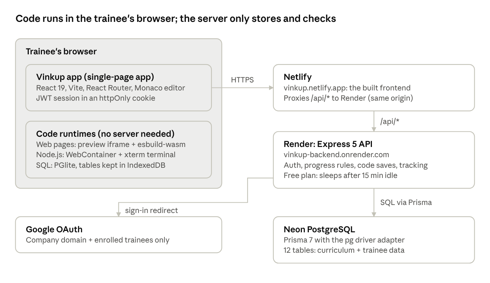
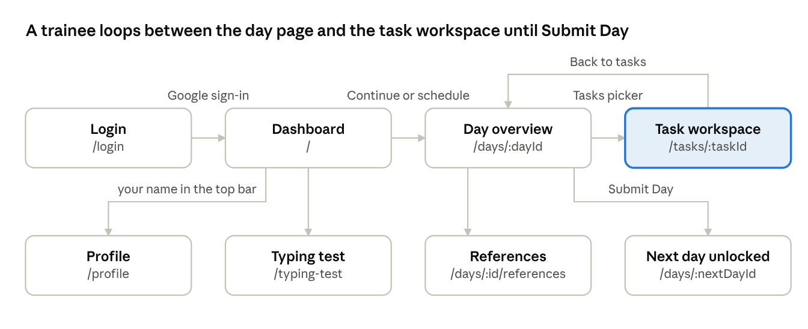
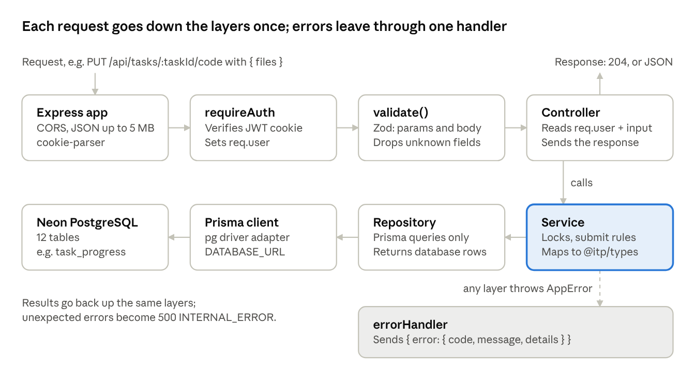

# Vinkup Architecture Overview

_9 October 2026 · v0.2.0_

## 1. Overview

This document explains how Vinkup is built: the parts of the system, how the frontend moves a trainee from sign-in to Submit Day, and how the backend is organised. It's written for the developers who will maintain the platform. For requirements see the TRD and PRD; for every endpoint see the [API reference](api-specifications.md); to run it locally see the [setup guide](setup-guide.md); for the tables see the [database documentation](database.md).

Vinkup is Vonnue's in-house training platform for new engineering trainees. It carries 8 courses (HTML, CSS, JavaScript, TypeScript, Node.js, PostgreSQL, Prisma, React) with 54 days and 260 tasks. A trainee signs in with their company Google account, opens the day that's unlocked, reads the lesson, solves the tasks in a code editor in the browser, submits them, and submits the day to unlock the next. While they work, the platform records active time, coding time and focus events (leaving fullscreen, switching tabs), and turns the focus events into an integrity score. Mentors sign in to a separate mentor dashboard (`/admin`) to follow every trainee, read their submitted code and journal, review their flags, add trainees and print progress reports.

The main design decision: **all trainee code runs in the browser.** Web pages render in a sandboxed iframe, Node.js projects run in a WebContainer, and SQL runs in PGlite (PostgreSQL compiled to WebAssembly). The server never executes trainee code; it stores files, applies progress rules and records activity. That removes the risk of running untrusted code on a server.

**Code runs in the trainee's browser; the server only stores and checks.**



| Part          | Technology                                                | Where it runs                    |
| ------------- | --------------------------------------------------------- | -------------------------------- |
| Frontend      | React 19, Vite, React Router, Monaco, Axios               | Netlify (static)                 |
| Code runtimes | iframe + esbuild-wasm, WebContainer API + xterm, PGlite   | Trainee's browser                |
| Backend       | Node.js 22, Express 5, Zod 4, Passport (Google), JWT      | Render                           |
| Database      | PostgreSQL, Prisma 7 with `@prisma/adapter-pg`            | Neon                             |
| Shared types  | `@itp/types` (TypeScript only)                            | Imported by frontend and backend |
| Users         | Trainees, and mentors (role `admin`) with their own pages | Same app, routed by role         |

## 2. Architecture

### Environments

The same frontend build runs in three ways. `VITE_` variables are fixed at build time, so changing one needs a new deploy.

| Environment                              | Frontend                     | API calls go to                                          | Data                       |
| ---------------------------------------- | ---------------------------- | -------------------------------------------------------- | -------------------------- |
| Local                                    | Vite dev server on port 5173 | Vite proxies `/api` to the backend on `localhost:3000`   | Local or Neon database     |
| Pull request previews and branch deploys | Netlify preview URL          | Nowhere: `VITE_USE_MOCKS=true` installs the mock adapter | Sample data in the browser |
| Production                               | vinkup.netlify.app           | Netlify proxies `/api/*` to vinkup-backend.onrender.com  | Neon PostgreSQL            |

In every environment the frontend calls a relative `/api` path. Because Netlify (or Vite, locally) forwards it, the browser sees one origin: no CORS preflight in production, and the session cookie is a first-party cookie.

### How a request travels

1. A page calls a function in `frontend/src/api/` (for example `getDayTasks`), which uses the shared Axios client: base URL `/api`, cookies included, 15-second timeout.
2. Netlify's `_redirects` rule forwards `/api/*` to Render. Netlify waits about 26 seconds; a sleeping Render service can take longer to wake, so the first request after a quiet spell can fail.
3. Express parses JSON (5 MB limit) and cookies. The router's guard (`requireTrainee` or `requireAdmin`, both built on `requireAuth`) reads the `auth_token` cookie and verifies the JWT; the user's id, name, email and role go on `req.user`. The wrong role gets 403; `requireAdmin` also checks that the mentor's `admin` row is still active.
4. The route's Zod schema validates params and body; the controller calls a service; the service applies the rules and calls a repository; the repository uses Prisma against Neon.
5. Errors are thrown as `AppError` subclasses and turned into `{ error: { code, message, details? } }` by the error handler. The Axios interceptor converts them to an `ApiError`; a 401 signs the trainee out.

### Sign-in

1. **Continue with Google** sends the browser to `/api/auth/google`; Passport redirects to Google.
2. Google returns to `/api/auth/google/callback`. The backend checks the email's domain against `ALLOWED_EMAIL_DOMAIN`, then looks for an **active** row in the `admin` table, then for a row in the `trainee` table. Mentors are checked first, so an email in both signs in as a mentor.
3. If one matches, it signs a JWT (`id`, `name`, `email`, `role`), sets it as the httpOnly `auth_token` cookie for 7 days, and redirects mentors to `/admin` and trainees to the dashboard. If not, it redirects to `/login?error=DOMAIN_NOT_PERMITTED` or `NOT_PROVISIONED`, and the login page shows Access Restricted.
4. On every page load `AuthProvider` calls `GET /api/auth/me` to learn who is signed in and their role. **Log out** calls `POST /api/auth/logout`, which clears the cookie.

There are no server sessions: the JWT is the session. Its lifetime is `JWT_EXPIRES_IN` (default 1 hour), so production must set it to `7d` to match the cookie.

### Cross-origin isolation

WebContainer needs the page to be cross-origin isolated. Every route is served with `Cross-Origin-Opener-Policy: same-origin` and `Cross-Origin-Embedder-Policy: credentialless`: by `frontend/public/_headers` on Netlify and by `vite.config.ts` locally. It must be every route, not only task pages, because the app is a single-page app and the first page loaded decides the isolation. Anything the app embeds from another origin must work under these headers.

## 3. Repository layout

One repository, three npm workspaces, Node.js 22 or later. The root holds the shared lint, format and commit rules.

```
Training-platform/
├─ frontend/                 React app (workspace "frontend")
│  ├─ public/                _headers, _redirects, favicon
│  └─ src/
│     ├─ pages/              one folder per route (Dashboard, DayOverview, Task, Admin..., ...)
│     ├─ components/         reusable UI, one folder per component with its CSS module and tests
│     ├─ api/                API calls, Axios client, error mapping, mock adapter
│     │  ├─ dayOverview/     day content per course (source of the curriculum)
│     │  └─ mockTasks/       task catalog, starter files, SQL setup (source of the curriculum)
│     ├─ runtimes/           browser, node and sql runtimes + RuntimeHost
│     ├─ context/            AuthProvider, ActivityProvider
│     ├─ hooks/              flag tracking, fullscreen, typing test, reference search
│     ├─ lib/                pure helpers (save rules, paste blocking, file tree, Monaco setup)
│     ├─ content/            reference pages for every day
│     ├─ routes/             ProtectedRoute, PublicOnlyRoute, RoleRoute
│     └─ constants/          course list, typing test words
├─ backend/                  Express API (workspace "backend")
│  ├─ prisma/                schema.prisma, migrations/, seed-data/curriculum.json
│  ├─ prisma7.config.ts      Prisma CLI config (pass --config)
│  └─ src/
│     ├─ app.ts, server.ts   Express app and its startup
│     ├─ module/             one folder per feature (auth, admin, dashboard, day, task, ...)
│     ├─ middleware/         requireAuth/Trainee/Admin, validate, notFound, errorHandler
│     ├─ errors/             AppError and its subclasses
│     ├─ config/env.ts       environment variables, checked with Zod at startup
│     ├─ lib/                Prisma client, seed script
│     ├─ utils/              JWT, IST dates
│     └─ test/api/           API contract tests
├─ packages/types/           @itp/types: request and response types shared by both sides
├─ scripts/export-curriculum.ts
├─ docs/                     project documentation (conventions, setup, API, architecture, database)
└─ netlify.toml              build settings and per-context VITE_ variables
```

### Where the curriculum comes from

The course content was first written as frontend data for mock mode, and it is still edited there. A script turns it into the seed file:

1. Edit day content in `frontend/src/api/dayOverview/` or tasks and starter files in `frontend/src/api/mockTasks/`.
2. Run `npx tsx scripts/export-curriculum.ts` from the root. It writes `backend/prisma/seed-data/curriculum.json`.
3. Run `npm run db:seed -w backend`. The seed upserts courses, days, objectives, checklist items, tasks and the trainee list, and never deletes trainee data.

Reference pages (`frontend/src/content/`) are not in the database; they ship with the frontend.

## 4. Frontend

A single-page React app built with Vite. Plain CSS modules. Monaco is the code editor; Axios makes the API calls.

### App shell

`main.tsx` installs the mock adapter when `VITE_USE_MOCKS=true`, then renders the app inside `ToastProvider` and `BrowserRouter`. `App.tsx` wraps every route in three layers, outermost first:

| Layer              | What it does                                                                                                                                    |
| ------------------ | ----------------------------------------------------------------------------------------------------------------------------------------------- |
| `AuthProvider`     | Calls `GET /auth/me` on load; holds `loading`, `authenticated` or `unauthenticated`; registers the Axios 401 handler that signs the trainee out |
| `FullscreenGate`   | For signed-in trainees (not mentors), blocks the app until the browser is in fullscreen ("Fullscreen required")                                 |
| `ActivityProvider` | For trainees only: counts active, coding and reading time and sends it to the API every 60 seconds and when the page is hidden                  |

`ProtectedRoute` shows a loader while `/me` is pending and redirects to `/login` when signed out; `PublicOnlyRoute` keeps signed-in users off the login page. Inside it, `RoleRoute` splits the routes by role: trainee routes send a mentor to `/admin`, and mentor routes send a trainee to `/`. The task page is lazy-loaded, because Monaco and the runtimes are large.

### Page flow

**A trainee loops between the day page and the task workspace until Submit Day.**



| Route                        | Page              | Data it loads                                                                                                                 |
| ---------------------------- | ----------------- | ----------------------------------------------------------------------------------------------------------------------------- |
| `/login`                     | LoginPage         | None. Reads `?error=` and shows Access Restricted for `DOMAIN_NOT_PERMITTED`, `NOT_PROVISIONED` or `LOGIN_FAILED`             |
| `/`                          | DashboardPage     | `GET /dashboard`, then `GET /courses/:courseId/days` for the selected course tab                                              |
| `/days/:dayId`               | DayOverviewPage   | In parallel: `GET /days/:dayId`, `/tasks`, `/status`, `/journal`. Saves with `PUT /journal`, completes with `PATCH /complete` |
| `/days/:dayId/references`    | ReferencePage     | None: the reference content ships with the frontend (`src/content/`)                                                          |
| `/tasks/:taskId`             | TaskPage          | In parallel: `GET /tasks/:taskId` and `GET /tasks/:taskId/code`                                                               |
| `/profile`                   | ProfilePage       | `GET /profile`                                                                                                                |
| `/typing-test`               | TypingTestPage    | `GET /typing-test/results`; saves with `POST /typing-test/results`                                                            |
| `/journal`                   | JournalPage       | `GET /journal`; today's entry saves with `PUT /days/:dayId/journal`                                                           |
| `/help`                      | HelpPage          | None: the help content ships with the frontend                                                                                |
| `/certificates/:courseId`    | CertificatePage   | `GET /courses/:courseId/certificate`; prints landscape with Print / Save as PDF                                               |
| `/admin`                     | AdminTraineesPage | Mentors. `GET /admin/trainees`; adds with `POST /admin/trainees`; search, sort, filter and CSV export run in the browser      |
| `/admin/trainees/:traineeId` | AdminTraineePage  | Mentors. `GET /admin/trainees/:traineeId` and `/flags`; `/tasks/:taskId/code` when a task is opened; print report             |
| `*`                          | NotFoundPage      | None                                                                                                                          |

The day page also loads `GET /days/:dayId/integrity` for its integrity badge (if the request fails, the badge shows Unavailable; a day with no score yet shows 100). The profile page lists earned certificates: it reads `completedCourseIds` from `GET /dashboard` and loads each certificate. The dashboard's course tabs show a Certificate badge for those courses.

A locked day answers the task list with 403 `DAY_LOCKED`, so the day page shows its locked state. After `PATCH /days/:dayId/complete` succeeds, the page shows Day completed and a Next day button, which loads `GET /courses/:courseId/days` and opens the next day of the course.

### API layer and mock mode

Every call lives in `src/api/` as a typed function (`getDayTasks`, `saveTaskCode`, ...) using the request and response types from `@itp/types`. Pages never call Axios directly. `errors.ts` turns any failure into an `ApiError` with `status`, `code` and `message`, so pages can branch on codes like `DAY_LOCKED`.

`mockAdapter.ts` replaces Axios's network adapter and answers every endpoint from in-memory data, with the same rules as the real API (locks, Submit Day counts, journal limits); its mentor endpoints refuse a trainee with 403. `VITE_MOCK_ROLE=admin` makes `/auth/me` answer as a mentor; the default is a trainee. It makes the app work with no backend: pull request previews run on it. It must never be on in production; `netlify.toml` sets it to `false` for the production context.

### Task workspace

The task page is the largest part of the frontend. Its state lives in a reducer (`pages/TaskPage/state/`): the open files, the active file, which files have unsaved changes, and the layout. Monaco keeps one model per file (`useMonacoModels`).

**Saving.** `useAutosave` saves 2 seconds after typing stops, and at least every 8 seconds while typing continues. Each save sends every file of the task in one `PUT /tasks/:taskId/code`. Before sending, `lib/saveRules.ts` checks the limits (200,000 characters per file, 5 MB for the task); a broken rule shows the message and blocks saving instead of sending. A failed save retries after 5 seconds; offline, it waits for the connection. Ctrl/Cmd+S, Back to tasks and Submit Task save first.

**Paste blocking.** `usePasteBlock` stops paste and drop in the editor and the Node.js terminal, shows "Pasting is turned off in the workspace", and reports a `PASTE_BLOCKED` flag (throttled to one every 2 seconds).

**Runtimes.** `RuntimeHost` picks one by the task's `runtime` field. The Result pane stays mounted when hidden, so a running process survives switching panes.

| Runtime   | Tasks                                                                | How it works                                                                                                                                                                                                                                                                                                                                                                                                                                                   |
| --------- | -------------------------------------------------------------------- | -------------------------------------------------------------------------------------------------------------------------------------------------------------------------------------------------------------------------------------------------------------------------------------------------------------------------------------------------------------------------------------------------------------------------------------------------------------- |
| `browser` | 153 (HTML, CSS, most JavaScript)                                     | Builds one HTML document from the task files: CSS and SVG are inlined, JavaScript and TypeScript are bundled by esbuild-wasm. Renders it in a sandboxed `srcdoc` iframe; a bridge script sends `console` output and errors back to the Console panel                                                                                                                                                                                                           |
| `node`    | 98 (Node.js, TypeScript, React, some JavaScript, Prisma, PostgreSQL) | Boots one WebContainer per browser tab, mounts the files, runs `npm install` when `package.json` lists packages, and opens a `jsh` shell in an xterm terminal. Run types the task's `runCommand` (`npm test`, `npm run check` or `npm run dev`). Edits sync into the container; a dev server's port shows in a preview. Prisma tasks also get hidden helper files and keep their database in IndexedDB ([Prisma in the workspace](prisma-in-the-workspace.md)) |
| `sql`     | 9 (PostgreSQL)                                                       | Runs PGlite (PostgreSQL in WebAssembly), stored in IndexedDB under a name built from the trainee and task. The task's `setupSql` runs once, when the database is new or the setup changed. A Web Lock lets one tab own it; a second tab gets an in-memory database. Results are capped at 500 rows                                                                                                                                                             |

### Mentor pages

Mentor pages use their own header (`AdminHeader`) and skip the fullscreen gate and time tracking. Everything they show comes from the five `/api/admin` endpoints; the rest is worked out in the browser:

- **Trainees page:** cohort summary cards (`lib/adminTrainees.ts`, `summarizeCohort`), and search, sort and filter kept in the URL (`lib/traineeListState.ts`). _Needs attention_ (`needsAttention`) flags a trainee who is inactive for 2+ days (never for someone with no activity yet, or who has finished), more than 3 days behind the cohort's median, or below 75 on integrity. CSV export (`toCsv`) writes the rows on screen.
- **Trainee page:** tabs for tasks, journal and flags; the read-only `ReadOnlyCodeViewer` (Monaco, no paste-block or flag hooks, so viewing never logs anything); and the print report (`usePrintMode`, `PrintReport`), which renders only while printing, in the light theme.

### Focus and activity tracking

**Flags.** `useFlagTracking` runs on the task page. It listens for leaving fullscreen, the tab becoming hidden and the window losing focus, measures how long the trainee was away, and sends `POST /activity/:taskId/events` with `FULLSCREEN_EXIT`, `TAB_SWITCH` or `WINDOW_BLUR` and the duration when they come back. It then shows the warning toast. A flag that fails to send is dropped. Durations are sent in milliseconds.

**Time.** `ActivityProvider` ticks every second while the trainee is signed in. A second counts as active only when the page is visible and there was input (keys, clicks, scroll, mouse) in the last 5 minutes. The task page reports `coding` while the trainee has typed within the last minute; the rest of active time is shown as reading time. Totals go to `POST /activity/time` every 60 seconds in batches of at most 10 minutes, with the IST date; on hiding the page they're sent with `fetch` `keepalive` so they survive closing the tab. Failed batches are kept for the next flush.

## 5. Backend

An Express 5 API in TypeScript, run with `tsx` in development and compiled with `tsc` for production. It has no views and no server sessions: every route except sign-in and health needs the JWT cookie, and each router only accepts one role.

### App setup

`server.ts` starts the app on `PORT` (default 3000). `config/env.ts` checks every environment variable with Zod at startup and stops with a clear message if one is missing. `app.ts` sets up, in order:

1. CORS for `FRONTEND_URL`, with credentials.
2. `express.json` with a 5 MB limit, `cookie-parser`, and Passport (no sessions).
3. `GET /api/health`, then the routers. `/api/auth` and the flag router put their guards on the routes; every trainee router is mounted behind `requireTrainee`, and `/api/admin` behind `requireAdmin`.
4. `notFoundHandler` (404 for unknown paths), then `errorHandler`.

### Module pattern

Each feature is a folder in `src/module/` with the same layers. A request only moves down the list.

| Layer      | File              | Job                                                                                                  |
| ---------- | ----------------- | ---------------------------------------------------------------------------------------------------- |
| Routes     | `*.routes.ts`     | Path, method and the `validate({ params, body })` middleware with the Zod schemas                    |
| Schema     | `*.schema.ts`     | Zod schemas for params and body; the parsed body replaces `req.body`, so unknown fields are dropped  |
| Controller | `*.controller.ts` | Reads `req.user` and the validated input, calls the service, sends the response; errors go to `next` |
| Service    | `*.service.ts`    | Business rules: locks, submit rules, shaping data into the `@itp/types` response types               |
| Repository | `*.repository.ts` | Prisma queries only; returns database rows (snake_case)                                              |

Responses use the camelCase types from `@itp/types`; database column names never leave a service.

### How data passes through

**Each request goes down the layers once; errors leave through one handler.** The example is a code save from the task page.



`requireTrainee` turns the cookie into `req.user` (and checks the role), `validate` checks the `taskId` and the `files` array, and the controller calls `taskService.saveCode`. The service asks `ProgressService` whether the task's day is unlocked (a `DAY_LOCKED` error stops here), then the repository upserts the trainee's `task_progress` row with the files and `code_updated_at`. The controller answers 204 with no body. Read endpoints follow the same path, with the service mapping database rows to the `@itp/types` response before the controller sends it as JSON.

### Modules

| Module      | Endpoints                                                                                                                      | Notes                                                                                                                                                                                            |
| ----------- | ------------------------------------------------------------------------------------------------------------------------------ | ------------------------------------------------------------------------------------------------------------------------------------------------------------------------------------------------ |
| auth        | `GET /auth/google`, `GET /auth/google/callback`, `GET /auth/me`, `POST /auth/logout`                                           | Google strategy checks the domain, then the `admin` table, then the `trainee` table; signs the JWT with the role                                                                                 |
| dashboard   | `GET /dashboard`, `GET /courses/:courseId/days`, `GET /courses/:courseId/certificate`                                          | Current day, course progress, time totals, typing summary, finished courses; day statuses per course; certificates (`certificate.service.ts`)                                                    |
| day         | `GET /days/:dayId`, `GET /status`, `GET /tasks`, `GET /integrity`, `GET` and `PUT /journal`, `PATCH /complete`; `GET /journal` | Day content, lock state, task list, integrity score (`integrity.scoring.ts`, pure functions), journal, Submit Day, the journal page list. Also a legacy `PATCH /status` kept for an older client |
| task        | `GET /tasks/:taskId`, `GET` and `PUT /code`, `POST /submit`                                                                    | Task definition, saved files (or starter files if never saved), save, submit                                                                                                                     |
| flag        | `POST /activity/:taskId/events`                                                                                                | Stores a focus event for a task                                                                                                                                                                  |
| activity    | `POST /activity/time`, `GET /activity/time`                                                                                    | Adds seconds to the trainee's row for that IST date                                                                                                                                              |
| typing-test | `POST /typing-test/results`, `GET /typing-test/results`                                                                        | Saves and lists results                                                                                                                                                                          |
| profile     | `GET /profile`                                                                                                                 | Current position, totals, latest typing result, last 7 days                                                                                                                                      |
| progress    | (no routes)                                                                                                                    | `ProgressService`: the one unlock rule (`isDayUnlocked`) and day statuses, used by every module                                                                                                  |
| admin       | `GET /admin/trainees`, `POST /admin/trainees`, `GET /admin/trainees/:traineeId`, `/flags`, `/tasks/:taskId/code`               | Mentor views, read-only except adding a trainee. The list uses a fixed number of queries; `integrity.overall.ts` averages each trainee's day scores with the day module's scoring                |

All paths are under `/api`. The [API reference](api-specifications.md) has every request and response.

### Progress and unlock rules

There is no unlock table: locks are worked out from `day_completion` rows each time.

- Days are ordered by course `sort_order`, then `day_number`. The first day is always open; a day opens when the day before it is completed; completed days stay open.
- A task is open when its day is open. Saving and submitting a task on a locked day returns 403 `DAY_LOCKED`.
- Submitting a task sets its `task_progress` status to `completed` and records the first and last submit times. Saving after that keeps it completed.
- **Submit Day** (`PATCH /days/:dayId/complete`): unknown day 404; locked 403 `DAY_LOCKED`; already completed returns success again; otherwise every non-stretch task must be completed, or 403 `CHECKLIST_INCOMPLETE` with the counts. It then upserts the `day_completion` row and returns the next day's id (possibly the first day of the next course, or `null` after the last day) in one transaction.
- The self-check list and the journal never block Submit Day.

The rule lives in one place, `ProgressService.isDayUnlocked()`; `day-module/day-access.services.ts` only calls it. (Before v0.2.0 there were two copies.)

### Integrity score

Worked out on request from `flag_event` rows; nothing is stored. Each task the trainee worked on (saved code or any flag) starts at 100 and loses points per flag, weighted by the flag's review priority; the day score is the rounded average of its task scores, and a mentor sees the average of the day scores. The numbers are in `SCORING` in `day-module/integrity.scoring.ts`, and the [API reference](api-specifications.md#get-apidaysdayidintegrity) lists them.

### Roles

| Guard            | Allows                                                           | Used on                                 |
| ---------------- | ---------------------------------------------------------------- | --------------------------------------- |
| `requireAuth`    | Any valid JWT cookie                                             | `/auth/me`, `/auth/logout`              |
| `requireTrainee` | `role === 'trainee'`                                             | Every trainee router and the flag route |
| `requireAdmin`   | `role === 'admin'` and an active `admin` row (checked each time) | `/api/admin`                            |

Mentors are rows in the `admin` table, seeded from the list in `lib/seed.ts` (or added by hand). There is no screen to add mentors.

### Validation and errors

Every error is an `AppError` with an HTTP status and a code from `ErrorCode` in `@itp/types`, sent as `{ "error": { "code", "message", "details"? } }`. Messages are safe to show to the trainee. Body-parser failures (too large, broken JSON) become 400 `VALIDATION_FAILED`. Anything else is logged and answered 500 `INTERNAL_ERROR` with no internal details.

| Code                                       | Status     | When                                                           |
| ------------------------------------------ | ---------- | -------------------------------------------------------------- |
| `VALIDATION_FAILED`                        | 400        | Params or body fail the Zod schema; `details` lists the issues |
| `UNAUTHENTICATED`                          | 401        | No cookie, or the JWT is invalid or expired                    |
| `DAY_LOCKED`                               | 403        | The day (or the task's day) is locked                          |
| `CHECKLIST_INCOMPLETE`                     | 403        | Submit Day with required tasks not submitted                   |
| `FORBIDDEN`                                | 403        | Wrong role, inactive mentor, or a certificate not earned yet   |
| `TRAINEE_EXISTS`, `EMAIL_BELONGS_TO_ADMIN` | 409        | Adding a trainee whose email is already taken                  |
| `NOT_FOUND`                                | 404        | Unknown day, task, course or path                              |
| `DOMAIN_NOT_PERMITTED`, `NOT_PROVISIONED`  | (redirect) | Sign-in refused; sent to the login page as `?error=`           |
| `INTERNAL_ERROR`                           | 500        | Any unexpected error                                           |

### Data model

PostgreSQL on Neon through Prisma 7 with the `pg` driver adapter. The schema is `backend/prisma/schema.prisma`; migrations are in `prisma/migrations/`. The generated client goes to `src/generated/prisma`.

| Table                | Holds                                                                                              | Key rules                                                    |
| -------------------- | -------------------------------------------------------------------------------------------------- | ------------------------------------------------------------ |
| `course`             | The 8 courses and their order                                                                      | Seeded                                                       |
| `curriculum_day`     | 54 days: title, summary, journal prompt                                                            | Unique (course, day number). Seeded                          |
| `learning_objective` | Objectives for each day                                                                            | Seeded                                                       |
| `self_check_item`    | Self-check list for each day                                                                       | Seeded                                                       |
| `task`               | 260 tasks: instructions, runtime, `run_command`, `setup_sql`, `starter_files` (JSON), stretch flag | Unique (day, sequence). Seeded                               |
| `trainee`            | Enrolled trainees (email, name)                                                                    | Seeded from the list in `lib/seed.ts`, or added by a mentor  |
| `admin`              | Mentor accounts: email, name, `is_active`, last sign-in                                            | Seeded from `lib/seed.ts`; no links to other tables          |
| `task_progress`      | A trainee's saved files (JSON) and status for a task, with save and submit times                   | One row per trainee and task; `files` null means never saved |
| `day_completion`     | Days a trainee has completed                                                                       | One row per trainee and day                                  |
| `journal_response`   | Journal text                                                                                       | One row per trainee and day                                  |
| `typing_test_result` | WPM and accuracy                                                                                   | Many per trainee                                             |
| `flag_event`         | Focus events with type, duration, context and review priority                                      | Many per trainee and task                                    |
| `activity_log`       | Active and coding seconds per IST calendar day                                                     | One row per trainee and date                                 |

Curriculum tables change only through the seed; trainee tables are written by the API. Deleting a trainee cascades to their data.

## 6. Build, test and deploy

### Scripts

| Command (from the root)                             | What it does                                                                     |
| --------------------------------------------------- | -------------------------------------------------------------------------------- |
| `npm run dev:frontend`                              | Vite dev server on port 5173, proxying `/api` to port 3000                       |
| `npm run dev:backend`                               | Backend with `tsx watch`                                                         |
| `npm test`                                          | Vitest in every workspace                                                        |
| `npm run test:api -w backend`                       | API contract tests against a test database                                       |
| `npm run build -w frontend`                         | Type-check and build to `frontend/dist`                                          |
| `npm run build -w backend` / `npm start -w backend` | Compile to `backend/dist` / run it                                               |
| `npm run db:seed -w backend`                        | Upsert trainees and curriculum (`SEED_DEMO=true` adds demo progress, local only) |
| `npx tsx scripts/export-curriculum.ts`              | Rebuild `curriculum.json` from the frontend curriculum data                      |

The Prisma CLI needs the config file: `npx prisma migrate deploy --config prisma7.config.ts` (from `backend/`). The [setup guide](setup-guide.md) has the full local setup.

### Checks on every commit

Husky runs these before a commit is accepted:

- **pre-commit:** `lint-staged` (ESLint and Prettier on the changed files), then type checks for frontend and backend (`tsc -b`), then all unit tests.
- **commit-msg:** commitlint with the conventional commit format (`feat:`, `fix:`, `docs:` ...).

There is no CI pipeline yet; the hooks are the only automatic gate.

### Tests

- **Frontend:** Vitest and Testing Library, next to the code (`*.test.ts(x)`): components, hooks, runtimes, the mock adapter and the API functions.
- **Backend unit tests:** services and helpers (`*.test.ts` in each module and `utils/`).
- **Backend API tests:** `src/test/api/`, written before the endpoints as the contract. They call the real Express app with a signed test cookie and a real database.

### Deployment

| Part     | Host               | Deploys when                                                                | Configuration                                                   |
| -------- | ------------------ | --------------------------------------------------------------------------- | --------------------------------------------------------------- |
| Frontend | Netlify            | Every push to `main` (production) and every pull request (preview on mocks) | `netlify.toml`, `public/_redirects`, `public/_headers`          |
| Backend  | Render web service | Every push to `main`                                                        | Environment variables in the Render dashboard (see table below) |
| Database | Neon               | Migrations run with `prisma migrate deploy`; seed run by hand               | `DATABASE_URL`                                                  |

| Variable                                   | Used for                                                               | Production note                                       |
| ------------------------------------------ | ---------------------------------------------------------------------- | ----------------------------------------------------- |
| `DATABASE_URL`                             | Neon connection string                                                 | Required                                              |
| `GOOGLE_CLIENT_ID`, `GOOGLE_CLIENT_SECRET` | Google OAuth app                                                       | Required                                              |
| `GOOGLE_CALLBACK_URL`                      | Where Google returns                                                   | `https://vinkup.netlify.app/api/auth/google/callback` |
| `ALLOWED_EMAIL_DOMAIN`                     | Sign-in domain check                                                   | `vonnue.com`                                          |
| `FRONTEND_URL`                             | CORS origin and redirects after sign-in                                | `https://vinkup.netlify.app`                          |
| `JWT_SECRET`, `JWT_EXPIRES_IN`             | Signing the session token                                              | At least 16 characters; set `7d`                      |
| `SESSION_SECRET`                           | Required by `env.ts` (at least 32 characters) but not used by any code | Any long random value                                 |
| `NODE_ENV`                                 | `production` makes the cookie `Secure` and `SameSite=None`             | `production`                                          |
| `PORT`                                     | Listening port                                                         | Render sets it                                        |
