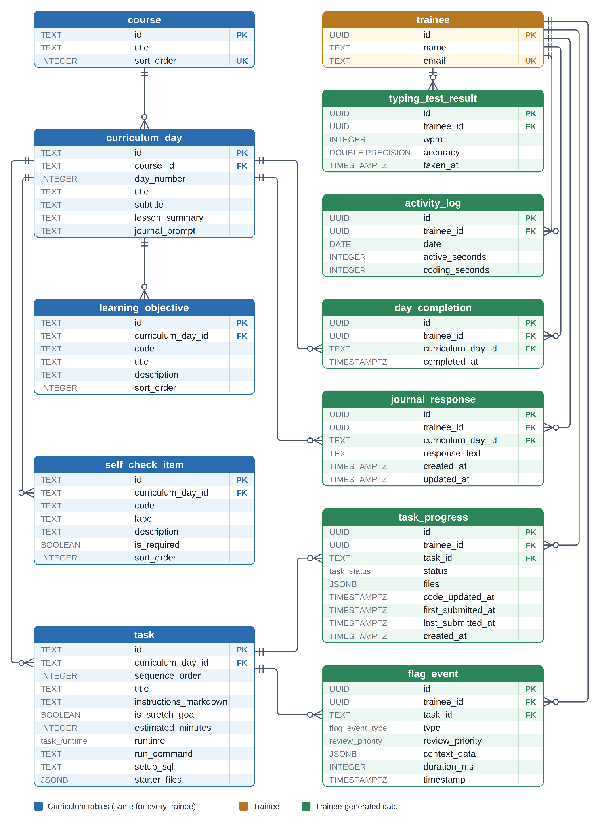

# **1\. Entity Relationship Diagram**

Every table in the database and how they relate. A crow's foot marks the many side of a one-to-many link. PK \= primary key, FK \= foreign key, UK \= unique key.

_Figure 1: Entity relationship diagram of the training platform database._

# **2\. Data Dictionary & Specifications**

The tables below formalize the exact schema constraints, data types, and keys derived from the ER model. Types are the PostgreSQL types produced by the Prisma schema.

Key legend: PK \= primary key, FK \= foreign key, UK \= unique key.

**Table: trainee**

_A person taking the training. Created in advance by the company; there is no self-registration._

| Column | Type | Key | Null? | Description                                                  |
| :----- | :--- | :-- | :---- | :----------------------------------------------------------- |
| id     | UUID | PK  | No    | Unique identifier for the trainee (generated automatically). |
| name   | TEXT | \-  | No    | Full name of the trainee.                                    |
| email  | TEXT | UK  | No    | Unique company email address used for login.                 |

**Table: course**

_A subject in the curriculum (html, css, js, ts, node, postgresql, prisma, react). Same for every trainee._

| Column      | Type    | Key | Null? | Description                                  |
| :---------- | :------ | :-- | :---- | :------------------------------------------- |
| id          | TEXT    | PK  | No    | Short course key, e.g. "html" or "css".      |
| title       | TEXT    | \-  | No    | Display name of the course.                  |
| sort\_order | INTEGER | UK  | No    | Curriculum order (html \= 1 ... react \= 8). |

**Table: curriculum\_day**

_One day of content inside a course. Loaded by the seed script._

| Column          | Type    | Key | Null? | Description                                                    |
| :-------------- | :------ | :-- | :---- | :------------------------------------------------------------- |
| id              | TEXT    | PK  | No    | Day key, e.g. "css-day-03".                                    |
| course\_id      | TEXT    | FK  | No    | References course(id).                                         |
| day\_number     | INTEGER | \-  | No    | Position of the day within its course.                         |
| title           | TEXT    | \-  | No    | Title of the day.                                              |
| subtitle        | TEXT    | \-  | No    | Subtitle; also used as the short description on the dashboard. |
| lesson\_summary | TEXT    | \-  | No    | Summary of the day's lesson.                                   |
| journal\_prompt | TEXT    | \-  | No    | Reflection question shown in the daily journal.                |

**Constraints:** UNIQUE (course\_id, day\_number).

**Table: learning\_objective**

_What a trainee should be able to do after a day._

| Column              | Type    | Key | Null? | Description                                           |
| :------------------ | :------ | :-- | :---- | :---------------------------------------------------- |
| id                  | TEXT    | PK  | No    | Objective key, e.g. "html-1-obj-1".                   |
| curriculum\_day\_id | TEXT    | FK  | No    | References curriculum\_day(id). Deleted with the day. |
| code                | TEXT    | \-  | No    | Objective number, e.g. "1.1".                         |
| title               | TEXT    | \-  | No    | Short title of the objective.                         |
| description         | TEXT    | \-  | No    | Full description of the objective.                    |
| sort\_order         | INTEGER | \-  | No    | Display order within the day.                         |

**Constraints:** INDEX (curriculum\_day\_id, sort\_order).

**Table: self\_check\_item**

_A checklist item a trainee reviews before completing a day._

| Column              | Type    | Key | Null? | Description                                           |
| :------------------ | :------ | :-- | :---- | :---------------------------------------------------- |
| id                  | TEXT    | PK  | No    | Item key, e.g. "html-1-check-1".                      |
| curriculum\_day\_id | TEXT    | FK  | No    | References curriculum\_day(id). Deleted with the day. |
| code                | TEXT    | \-  | No    | Item code.                                            |
| label               | TEXT    | \-  | No    | Short text shown next to the checkbox.                |
| description         | TEXT    | \-  | No    | Longer explanation of the item.                       |
| is\_required        | BOOLEAN | \-  | No    | Whether the item is required. Default: true.          |
| sort\_order         | INTEGER | \-  | No    | Display order within the day.                         |

**Constraints:** INDEX (curriculum\_day\_id, sort\_order).

**Table: task**

_A coding exercise inside a day._

| Column                 | Type          | Key | Null? | Description                                                   |
| :--------------------- | :------------ | :-- | :---- | :------------------------------------------------------------ |
| id                     | TEXT          | PK  | No    | Task key, e.g. "css-day-03-t-2".                              |
| curriculum\_day\_id    | TEXT          | FK  | No    | References curriculum\_day(id). Deleted with the day.         |
| sequence\_order        | INTEGER       | \-  | No    | Order of the task within the day.                             |
| title                  | TEXT          | \-  | No    | Title of the task.                                            |
| instructions\_markdown | TEXT          | \-  | No    | Task instructions written in Markdown.                        |
| is\_stretch\_goal      | BOOLEAN       | \-  | No    | Optional extra task; never blocks completion. Default: false. |
| estimated\_minutes     | INTEGER       | \-  | Yes   | Estimated time to finish the task.                            |
| runtime                | task\_runtime | \-  | No    | Where the code runs: browser, node or sql.                    |
| run\_command           | TEXT          | \-  | Yes   | Node tasks only, e.g. "npm test".                             |
| setup\_sql             | TEXT          | \-  | Yes   | SQL tasks only. SQL run before the trainee's query.           |
| starter\_files         | JSONB         | \-  | No    | Starting files as \[{ path, content }\]. Default: \[\].       |

**Constraints:** UNIQUE (curriculum\_day\_id, sequence\_order).

**Table: task\_progress**

_A trainee's saved work and status for one task._

| Column               | Type         | Key | Null? | Description                                                                  |
| :------------------- | :----------- | :-- | :---- | :--------------------------------------------------------------------------- |
| id                   | UUID         | PK  | No    | Unique identifier of the progress record.                                    |
| trainee\_id          | UUID         | FK  | No    | References trainee(id). Deleted with the trainee.                            |
| task\_id             | TEXT         | FK  | No    | References task(id).                                                         |
| status               | task\_status | \-  | No    | not\_started, in\_progress or completed. Default: in\_progress.              |
| files                | JSONB        | \-  | Yes   | Trainee's saved files. NULL means never saved; use the task's starter files. |
| code\_updated\_at    | TIMESTAMPTZ  | \-  | Yes   | When the code was last saved.                                                |
| first\_submitted\_at | TIMESTAMPTZ  | \-  | Yes   | When the task was first submitted.                                           |
| last\_submitted\_at  | TIMESTAMPTZ  | \-  | Yes   | When the task was most recently submitted.                                   |
| created\_at          | TIMESTAMPTZ  | \-  | No    | When the record was created. Default: now.                                   |

**Constraints:** UNIQUE (trainee\_id, task\_id) — one record per trainee per task.

**Table: day\_completion**

_Records that a trainee has completed a day._

| Column              | Type        | Key | Null? | Description                                       |
| :------------------ | :---------- | :-- | :---- | :------------------------------------------------ |
| id                  | UUID        | PK  | No    | Unique identifier of the completion record.       |
| trainee\_id         | UUID        | FK  | No    | References trainee(id). Deleted with the trainee. |
| curriculum\_day\_id | TEXT        | FK  | No    | References curriculum\_day(id).                   |
| completed\_at       | TIMESTAMPTZ | \-  | No    | When the day was completed. Default: now.         |

**Constraints:** UNIQUE (trainee\_id, curriculum\_day\_id) — a day can be completed once.

**Table: journal\_response**

_A trainee's daily journal entry._

| Column              | Type        | Key | Null? | Description                                       |
| :------------------ | :---------- | :-- | :---- | :------------------------------------------------ |
| id                  | UUID        | PK  | No    | Unique identifier of the journal entry.           |
| trainee\_id         | UUID        | FK  | No    | References trainee(id). Deleted with the trainee. |
| curriculum\_day\_id | TEXT        | FK  | No    | References curriculum\_day(id).                   |
| response\_text      | TEXT        | \-  | No    | The trainee's written answer.                     |
| created\_at         | TIMESTAMPTZ | \-  | No    | When the entry was first written. Default: now.   |
| updated\_at         | TIMESTAMPTZ | \-  | No    | When the entry was last edited (automatic).       |

**Constraints:** UNIQUE (trainee\_id, curriculum\_day\_id) — one entry per trainee per day.

**Table: typing\_test\_result**

_One typing test attempt._

| Column      | Type             | Key | Null? | Description                                                |
| :---------- | :--------------- | :-- | :---- | :--------------------------------------------------------- |
| id          | UUID             | PK  | No    | Unique identifier of the result.                           |
| trainee\_id | UUID             | FK  | No    | References trainee(id). Deleted with the trainee.          |
| wpm         | INTEGER          | \-  | No    | Words per minute.                                          |
| accuracy    | DOUBLE PRECISION | \-  | No    | Accuracy, 0–100, rounded to one decimal by the service.    |
| taken\_at   | TIMESTAMPTZ      | \-  | No    | When the test was taken (set by the server). Default: now. |

**Constraints:** INDEX (trainee\_id, taken\_at).

**Table: flag\_event**

_A suspicious-activity event logged for mentor review. Never shown to trainees and never penalises them automatically._

| Column           | Type              | Key | Null? | Description                                                    |
| :--------------- | :---------------- | :-- | :---- | :------------------------------------------------------------- |
| id               | UUID              | PK  | No    | Unique identifier of the event.                                |
| trainee\_id      | UUID              | FK  | No    | References trainee(id). Deleted with the trainee.              |
| task\_id         | TEXT              | FK  | No    | References task(id).                                           |
| type             | flag\_event\_type | \-  | No    | FULLSCREEN\_EXIT, TAB\_SWITCH, PASTE\_BLOCKED or WINDOW\_BLUR. |
| review\_priority | review\_priority  | \-  | No    | LOW, NORMAL or HIGH. Default: NORMAL.                          |
| context\_data    | JSONB             | \-  | Yes   | Extra details about the event.                                 |
| duration\_ms     | INTEGER           | \-  | Yes   | How long the trainee was away, in milliseconds.                |
| timestamp        | TIMESTAMPTZ       | \-  | No    | When the event happened (set by the server). Default: now.     |

**Constraints:** INDEX (trainee\_id, task\_id, timestamp).

**Table: activity\_log**

_Time a trainee spent on the platform each day._

| Column          | Type    | Key | Null? | Description                                       |
| :-------------- | :------ | :-- | :---- | :------------------------------------------------ |
| id              | UUID    | PK  | No    | Unique identifier of the log row.                 |
| trainee\_id     | UUID    | FK  | No    | References trainee(id). Deleted with the trainee. |
| date            | DATE    | \-  | No    | Calendar day in India time (Asia/Kolkata).        |
| active\_seconds | INTEGER | \-  | No    | Total active seconds that day. Default: 0\.       |
| coding\_seconds | INTEGER | \-  | No    | Seconds spent coding that day. Default: 0\.       |

**Constraints:** UNIQUE (trainee\_id, date) — one row per trainee per day.

## **Enumerations**

| Enum              | Allowed values                                              |
| :---------------- | :---------------------------------------------------------- |
| task\_runtime     | browser, node, sql                                          |
| task\_status      | not\_started, in\_progress, completed                       |
| flag\_event\_type | FULLSCREEN\_EXIT, TAB\_SWITCH, PASTE\_BLOCKED, WINDOW\_BLUR |
| review\_priority  | LOW, NORMAL, HIGH                                           |
