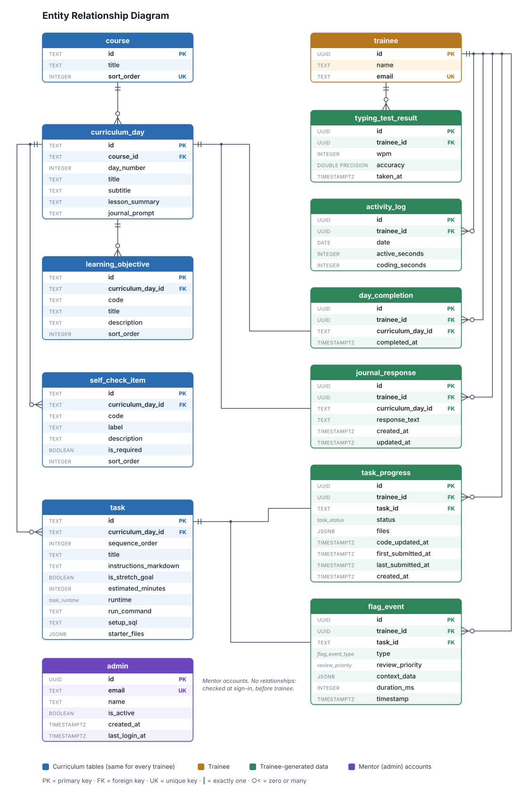

# Vinkup database

The PostgreSQL database behind the Vinkup API: 13 tables in three groups. **Curriculum tables** (`course`, `curriculum_day`, `learning_objective`, `self_check_item`, `task`) are the same for every trainee and are loaded by the seed script. **Trainee tables** hold each trainee's work, progress and activity, and are written by the API. **Accounts:** `trainee` (also a trainee table) and `admin` (mentors, added in v0.2.0). The source of truth is `backend/prisma/schema.prisma`; update this document in the same PR as any schema change.

## 1. Entity relationship diagram

Every table in the database and how they relate. A crow's foot marks the many side of a one-to-many link. PK = primary key, FK = foreign key, UK = unique key.

_Figure 1: Entity relationship diagram of the training platform database._

## 2. Data dictionary

The tables below formalize the exact schema constraints, data types, and keys derived from the ER model. Types are the PostgreSQL types produced by the Prisma schema.

Key legend: PK = primary key, FK = foreign key, UK = unique key.

### trainee

_A person taking the training. Created in advance by the seed script or by a mentor (`POST /api/admin/trainees`); there is no self-registration. An email can't be both a trainee and a mentor through the API (`EMAIL_BELONGS_TO_ADMIN`)._

| Column | Type | Key | Null? | Description                                                  |
| :----- | :--- | :-- | :---- | :----------------------------------------------------------- |
| id     | UUID | PK  | No    | Unique identifier for the trainee (generated automatically). |
| name   | TEXT | -   | No    | Full name of the trainee.                                    |
| email  | TEXT | UK  | No    | Unique company email address used for login.                 |

### admin

_A mentor account (role `admin`). Seeded from the list in `backend/src/lib/seed.ts`; there is no screen to add one. At sign-in an active admin row is checked before the `trainee` table. No other table references it._

| Column        | Type        | Key | Null? | Description                                                                                                 |
| :------------ | :---------- | :-- | :---- | :---------------------------------------------------------------------------------------------------------- |
| id            | UUID        | PK  | No    | Unique identifier of the mentor (generated by Prisma).                                                      |
| email         | TEXT        | UK  | No    | Company email used for login, stored lower-case.                                                            |
| name          | TEXT        | -   | No    | Full name of the mentor.                                                                                    |
| is_active     | BOOLEAN     | -   | No    | `false` = can no longer sign in as a mentor or call `/api/admin` (checked on every request). Default: true. |
| created_at    | TIMESTAMPTZ | -   | No    | When the row was created. Default: now.                                                                     |
| last_login_at | TIMESTAMPTZ | -   | Yes   | Last successful mentor sign-in; null until the first one.                                                   |

**Constraints:** UNIQUE (email).

### course

_A subject in the curriculum (html, css, js, ts, node, postgresql, prisma, react). Same for every trainee._

| Column     | Type    | Key | Null? | Description                                |
| :--------- | :------ | :-- | :---- | :----------------------------------------- |
| id         | TEXT    | PK  | No    | Short course key, e.g. "html" or "css".    |
| title      | TEXT    | -   | No    | Display name of the course.                |
| sort_order | INTEGER | UK  | No    | Curriculum order (html = 1 ... react = 8). |

### curriculum_day

_One day of content inside a course. Loaded by the seed script._

| Column         | Type    | Key | Null? | Description                                                    |
| :------------- | :------ | :-- | :---- | :------------------------------------------------------------- |
| id             | TEXT    | PK  | No    | Day key, e.g. "css-day-03".                                    |
| course_id      | TEXT    | FK  | No    | References course(id).                                         |
| day_number     | INTEGER | -   | No    | Position of the day within its course.                         |
| title          | TEXT    | -   | No    | Title of the day.                                              |
| subtitle       | TEXT    | -   | No    | Subtitle; also used as the short description on the dashboard. |
| lesson_summary | TEXT    | -   | No    | Summary of the day's lesson.                                   |
| journal_prompt | TEXT    | -   | No    | Reflection question shown in the daily journal.                |

**Constraints:** UNIQUE (course_id, day_number).

### learning_objective

_What a trainee should be able to do after a day._

| Column            | Type    | Key | Null? | Description                                          |
| :---------------- | :------ | :-- | :---- | :--------------------------------------------------- |
| id                | TEXT    | PK  | No    | Objective key, e.g. "html-1-obj-1".                  |
| curriculum_day_id | TEXT    | FK  | No    | References curriculum_day(id). Deleted with the day. |
| code              | TEXT    | -   | No    | Objective number, e.g. "1.1".                        |
| title             | TEXT    | -   | No    | Short title of the objective.                        |
| description       | TEXT    | -   | No    | Full description of the objective.                   |
| sort_order        | INTEGER | -   | No    | Display order within the day.                        |

**Constraints:** INDEX (curriculum_day_id, sort_order).

### self_check_item

_A checklist item a trainee reviews before completing a day._

| Column            | Type    | Key | Null? | Description                                          |
| :---------------- | :------ | :-- | :---- | :--------------------------------------------------- |
| id                | TEXT    | PK  | No    | Item key, e.g. "html-1-check-1".                     |
| curriculum_day_id | TEXT    | FK  | No    | References curriculum_day(id). Deleted with the day. |
| code              | TEXT    | -   | No    | Item code.                                           |
| label             | TEXT    | -   | No    | Short text shown next to the checkbox.               |
| description       | TEXT    | -   | No    | Longer explanation of the item.                      |
| is_required       | BOOLEAN | -   | No    | Whether the item is required. Default: true.         |
| sort_order        | INTEGER | -   | No    | Display order within the day.                        |

**Constraints:** INDEX (curriculum_day_id, sort_order).

### task

_A coding exercise inside a day._

| Column                | Type         | Key | Null? | Description                                                                                                                        |
| :-------------------- | :----------- | :-- | :---- | :--------------------------------------------------------------------------------------------------------------------------------- |
| id                    | TEXT         | PK  | No    | Task key, e.g. "css-day-03-t-2".                                                                                                   |
| curriculum_day_id     | TEXT         | FK  | No    | References curriculum_day(id). Deleted with the day.                                                                               |
| sequence_order        | INTEGER      | -   | No    | Order of the task within the day.                                                                                                  |
| title                 | TEXT         | -   | No    | Title of the task.                                                                                                                 |
| instructions_markdown | TEXT         | -   | No    | Task instructions written in Markdown.                                                                                             |
| is_stretch_goal       | BOOLEAN      | -   | No    | Optional extra task; never blocks completion. Default: false.                                                                      |
| estimated_minutes     | INTEGER      | -   | Yes   | Estimated time to finish the task.                                                                                                 |
| runtime               | task_runtime | -   | No    | Where the code runs: browser, node or sql.                                                                                         |
| run_command           | TEXT         | -   | Yes   | Node tasks only, e.g. "npm test".                                                                                                  |
| setup_sql             | TEXT         | -   | Yes   | SQL tasks only. Creates the starter tables; runs once when the trainee's in-browser database is created, or when this SQL changes. |
| starter_files         | JSONB        | -   | No    | Starting files as [{ path, content }]. Default: [].                                                                                |

**Constraints:** UNIQUE (curriculum_day_id, sequence_order).

### task_progress

_A trainee's saved work and status for one task._

| Column             | Type        | Key | Null? | Description                                                                  |
| :----------------- | :---------- | :-- | :---- | :--------------------------------------------------------------------------- |
| id                 | UUID        | PK  | No    | Unique identifier of the progress record.                                    |
| trainee_id         | UUID        | FK  | No    | References trainee(id). Deleted with the trainee.                            |
| task_id            | TEXT        | FK  | No    | References task(id).                                                         |
| status             | task_status | -   | No    | not_started, in_progress or completed. Default: in_progress.                 |
| files              | JSONB       | -   | Yes   | Trainee's saved files. NULL means never saved; use the task's starter files. |
| code_updated_at    | TIMESTAMPTZ | -   | Yes   | When the code was last saved.                                                |
| first_submitted_at | TIMESTAMPTZ | -   | Yes   | When the task was first submitted.                                           |
| last_submitted_at  | TIMESTAMPTZ | -   | Yes   | When the task was most recently submitted.                                   |
| created_at         | TIMESTAMPTZ | -   | No    | When the record was created. Default: now.                                   |

**Constraints:** UNIQUE (trainee_id, task_id) — one record per trainee per task.

### day_completion

_Records that a trainee has completed a day._

| Column            | Type        | Key | Null? | Description                                       |
| :---------------- | :---------- | :-- | :---- | :------------------------------------------------ |
| id                | UUID        | PK  | No    | Unique identifier of the completion record.       |
| trainee_id        | UUID        | FK  | No    | References trainee(id). Deleted with the trainee. |
| curriculum_day_id | TEXT        | FK  | No    | References curriculum_day(id).                    |
| completed_at      | TIMESTAMPTZ | -   | No    | When the day was completed. Default: now.         |

**Constraints:** UNIQUE (trainee_id, curriculum_day_id) — a day can be completed once.

### journal_response

_A trainee's daily journal entry._

| Column            | Type        | Key | Null? | Description                                       |
| :---------------- | :---------- | :-- | :---- | :------------------------------------------------ |
| id                | UUID        | PK  | No    | Unique identifier of the journal entry.           |
| trainee_id        | UUID        | FK  | No    | References trainee(id). Deleted with the trainee. |
| curriculum_day_id | TEXT        | FK  | No    | References curriculum_day(id).                    |
| response_text     | TEXT        | -   | No    | The trainee's written answer.                     |
| created_at        | TIMESTAMPTZ | -   | No    | When the entry was first written. Default: now.   |
| updated_at        | TIMESTAMPTZ | -   | No    | When the entry was last edited (automatic).       |

**Constraints:** UNIQUE (trainee_id, curriculum_day_id) — one entry per trainee per day.

### typing_test_result

_One typing test attempt._

| Column     | Type             | Key | Null? | Description                                                |
| :--------- | :--------------- | :-- | :---- | :--------------------------------------------------------- |
| id         | UUID             | PK  | No    | Unique identifier of the result.                           |
| trainee_id | UUID             | FK  | No    | References trainee(id). Deleted with the trainee.          |
| wpm        | INTEGER          | -   | No    | Words per minute.                                          |
| accuracy   | DOUBLE PRECISION | -   | No    | Accuracy, 0–100, rounded to one decimal by the service.    |
| taken_at   | TIMESTAMPTZ      | -   | No    | When the test was taken (set by the server). Default: now. |

**Constraints:** INDEX (trainee_id, taken_at).

### flag_event

_A focus event logged for mentor review. Trainees never see the list; the events feed the integrity score (shown to the trainee per day, and to mentors as an average), which is a guide and never blocks the trainee._

| Column          | Type            | Key | Null? | Description                                                                               |
| :-------------- | :-------------- | :-- | :---- | :---------------------------------------------------------------------------------------- |
| id              | UUID            | PK  | No    | Unique identifier of the event.                                                           |
| trainee_id      | UUID            | FK  | No    | References trainee(id). Deleted with the trainee.                                         |
| task_id         | TEXT            | FK  | No    | References task(id).                                                                      |
| type            | flag_event_type | -   | No    | FULLSCREEN_EXIT, TAB_SWITCH, PASTE_BLOCKED or WINDOW_BLUR.                                |
| review_priority | review_priority | -   | No    | LOW, NORMAL or HIGH. Default: NORMAL.                                                     |
| context_data    | JSONB           | -   | Yes   | Extra details about the event.                                                            |
| duration_ms     | INTEGER         | -   | Yes   | How long the trainee was away, in milliseconds (rows written before v0.2.0 hold seconds). |
| timestamp       | TIMESTAMPTZ     | -   | No    | When the event happened (set by the server). Default: now.                                |

**Constraints:** INDEX (trainee_id, task_id, timestamp).

### activity_log

_Time a trainee spent on the platform each day._

| Column         | Type    | Key | Null? | Description                                       |
| :------------- | :------ | :-- | :---- | :------------------------------------------------ |
| id             | UUID    | PK  | No    | Unique identifier of the log row.                 |
| trainee_id     | UUID    | FK  | No    | References trainee(id). Deleted with the trainee. |
| date           | DATE    | -   | No    | Calendar day in India time (Asia/Kolkata).        |
| active_seconds | INTEGER | -   | No    | Total active seconds that day. Default: 0.        |
| coding_seconds | INTEGER | -   | No    | Seconds spent coding that day. Default: 0.        |

**Constraints:** UNIQUE (trainee_id, date) — one row per trainee per day.

## 3. Enumerations

| Enum            | Allowed values                                          |
| :-------------- | :------------------------------------------------------ |
| task_runtime    | browser, node, sql                                      |
| task_status     | not_started, in_progress, completed                     |
| flag_event_type | FULLSCREEN_EXIT, TAB_SWITCH, PASTE_BLOCKED, WINDOW_BLUR |
| review_priority | LOW, NORMAL, HIGH                                       |
